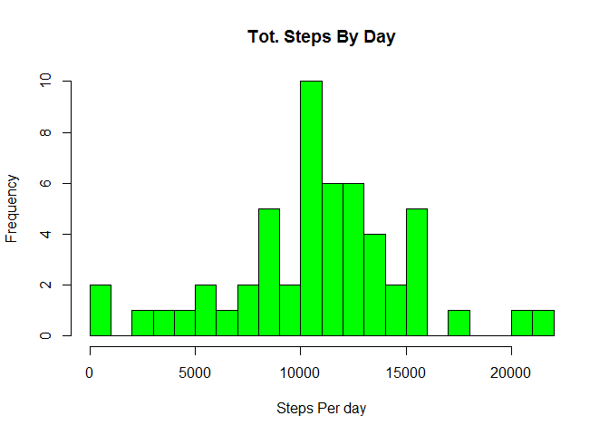

# Reproducible Research: Peer Assessment 1
Julian Cook  
19 Oct 2014  

Introduction
------------
This assignment makes use of data from a personal activity monitoring device. This device collects data at 5 minute intervals through out the day. The data consists of two months of data from an anonymous individual collected during the months of October and November, 2012 and include the number of steps taken in 5 minute intervals each day.

## Loading and preprocessing the data
The data was originally downloaded from this URL
https://d396qusza40orc.cloudfront.net/repdata%2Fdata%2Factivity.zip

The original variables prior to processing are:

* steps: Number of steps taking in a 5-minute interval (missing values are coded as NA)

* date: The date on which the measurement was taken in YYYY-MM-DD format

* interval: Identifier for the 5-minute interval in which measurement was taken

```r
setwd("C:/Users/jcook/Documents/R/repdata/assignment1")
library("data.table", lib.loc="~/R/win-library/3.1")
dtActivity<-fread("activity.csv")
```
A sample of the data is shown here:

```
##    steps       date interval
## 1:     6 2012-10-21     1955
## 2:    12 2012-10-21     2000
## 3:   219 2012-10-21     2005
## 4:    94 2012-10-21     2010
## 5:   457 2012-10-21     2015
## 6:   501 2012-10-21     2020
```

* The interval column increments by 5 each time, but resets to 0,100,200 every 60 mins (12 obs per hour).
* The first five mins are in the 0 bucket, last 5 in the 55 bucket

There are numerous NAs in the data, which need to be distinguished from cases where there are zero steps (user was stationary). You can see NA s at the head of the data, for instance. These need to be removed before analysis using complete.cases

```
##    steps       date interval
## 1:    NA 2012-10-01        0
## 2:    NA 2012-10-01        5
## 3:    NA 2012-10-01       10
## 4:    NA 2012-10-01       15
## 5:    NA 2012-10-01       20
```

## What is mean total number of steps taken per day?
To answer this we use only the complete.cases() and then use the data.table method to  sum all columns by date (except date), note that this sums un-needed columns as well, but we ignore those.


```r
dtActivityComplete<-complete.cases(dtActivity[,])
dtActivityCC<-dtActivity[dtActivityComplete,]
# CC = activity less steps=NA rows
dtSumStepsByDayCC<-dtActivityCC[,lapply(.SD, sum),by="date"] # will sum interval as well
# create the hist of steps by day, using 10 buckets
hist(dtSumStepsByDayCC$steps, breaks=20, col="green",xlab="Steps Per day",main="Tot. Steps By Day")
```

 

### Calculate and report the mean and median total number of steps taken per day


```
## [1] "Mean =  10766.1886792453"
```

```
## [1] "median =  10765"
```


## What is the average daily activity pattern?

Below is a a time series plot (using qplot) of the 5-minute interval (x-axis) and the average number of steps taken, averaged across all days (y-axis)

```
## Warning: The colnames(x)<-value syntax copies the whole table. This is due to <- in R itself. Please change to setnames(x,old,new) which does not copy and is faster. See help('setnames'). You can safely ignore this warning if it is inconvenient to change right now. Setting options(warn=2) turns this warning into an error, so you can then use traceback() to find and change your colnames<- calls.
## Warning: package 'ggplot2' was built under R version 3.1.1
```

 

**Which 5-minute interval, on average across all the days in the dataset, contains the maximum number of steps?**
The max steps occurs here: interval=835, 206.1698


```r
MaxAvgSteps<-dtActivityAvgByInterval[,max(AvgSteps)]
#dtActivityAvgByInterval[,AvgSteps==MaxAvgSteps]
tail(dtActivityAvgByInterval,1)
```

```
##    interval AvgSteps
## 1:      835    206.2
```


## Imputing missing values

There are a number of days/intervals where there are missing values (coded as NA). The presence of missing days may introduce bias into some calculations or summaries of the data.

Calculate and report the total number of missing values in the dataset (i.e. the total number of rows with NAs)

```r
dtActivityMissingValues<-nrow(dtActivity)-nrow(dtActivityCC) # num NA rows
paste("num NA rows: " , dtActivityMissingValues)
```

```
## [1] "num NA rows:  2304"
```
_Devise a strategy for filling in all of the missing values in the dataset._
The approach to filling missing values is to use the mean for that 5-minute interval


```r
# Create a new dataset that is equal to the original dataset but with the missing data filled in.
# the merge and replacement of NAs per the forum discussion
dtActivityNoNA<-merge(dtActivity, dtActivityAvgByInterval, by="interval")
dtActivityNoNA$steps[is.na(dtActivityNoNA$steps)] <- dtActivityNoNA$AvgSteps[is.na(dtActivityNoNA$steps)]
setkey(dtActivityNoNA, date,interval)
```


Make a histogram of the total number of steps taken each day and Calculate and report the mean and median total number of steps taken per day. Do these values differ from the estimates from the first part of the assignment? What is the impact of imputing missing data on the estimates of the total daily number of steps?


```r
dtSumStepsByDayNoNA<-dtActivityNoNA[,lapply(.SD, sum),by="date"]
hist(dtSumStepsByDayNoNA$steps, breaks=20, col="blue",xlab="Steps Per day",main="Tot. Steps By Day")
```

 
### Calculate and report the NEW mean and median total number of steps / day


```
## [1] "Mean =  10766.1886792453"
```

```
## [1] "median =  10766.1886792453"
```

## Are there differences in activity patterns between weekdays and weekends?

Create a new factor variable in the dataset with two levels – “weekday” and “weekend” indicating whether a given date is a weekday or weekend day.

Make a panel plot containing a time series plot (i.e. type = "l") of the 5-minute interval (x-axis) and the average number of steps taken, averaged across all weekday days or weekend days (y-axis). 

_In the graphs below, you can clearly see a pattern, where the steps in general take place later in the day, meaning the distribution is shifted to later intervals._


```r
dtActivityNoNA$IsWeekday<-ifelse(!weekdays(as.Date(dtActivityNoNA$date)) %in% c("Saturday", "Sunday"),"weekday","weekend")
ggplot(dtActivityNoNA,aes(interval,steps)) +geom_line() + facet_grid(.~IsWeekday)
```

 

```r
# Not clear that these are needed so commented out
# dtActivityNoNAAvgByInterval<-dtActivityNoNA[,mean(steps),by=interval]
# colnames(dtActivityNoNAAvgByInterval)<-c("interval","AvgSteps")
```
